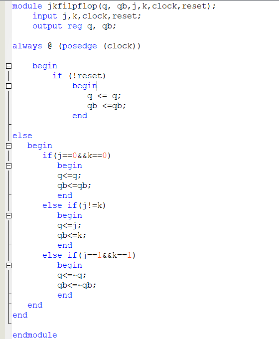
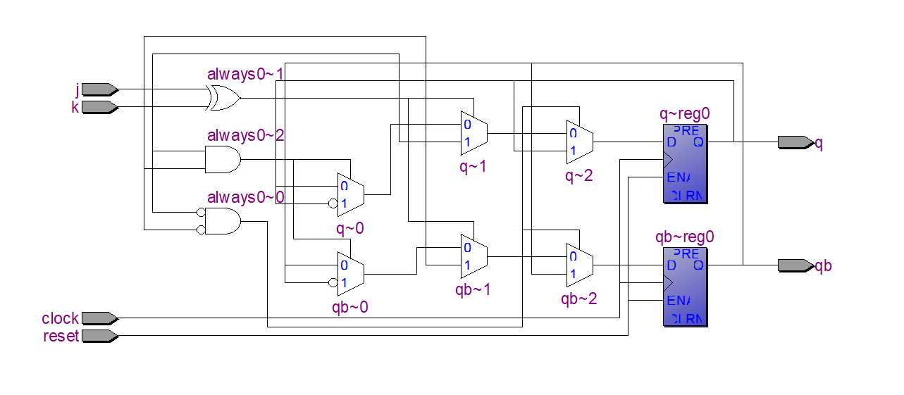

# JKFLIPFLOP-USING-IF-ELSE

## AIM: 

To implement  JK flipflop using verilog and validating their functionality using their functional tables

## SOFTWARE REQUIRED:

Quartus prime

## THEORY

## JK Flip-Flop

JK flip-flop is the modified version of SR flip-flop. It operates with only positive clock transitions or negative clock transitions. The circuit diagram of JK flip-flop is shown in the following figure.

This circuit has two inputs J & K and two outputs Qtt & Qtt’. The operation of JK flip-flop is similar to SR flip-flop. Here, we considered the inputs of SR flip-flop as S = J Qtt’ and R = KQtt in order to utilize the modified SR flip-flop for 4 combinations of inputs. The following table shows the state table of JK flip-flop.

 
Here, Qtt & Qt+1t+1 are present state & next state respectively. So, JK flip-flop can be used for one of these four functions such as Hold, Reset, Set & Complement of present state based on the input conditions, when positive transition of clock signal is applied. The following table shows the characteristic table of JK flip-flop. Present Inputs Present State Next State
 

By using three variable K-Map, we can get the simplified expression for next state, Qt+1t+1. Three variable K-Map for next state, Qt+1t+1 is shown in the following figure.
 

The maximum possible groupings of adjacent ones are already shown in the figure. Therefore, the simplified expression for next state Qt+1t+1 is Q(t+1)=JQ(t)′+K′Q(t)Q(t+1)=JQ(t)′+K′Q(t)

## Procedure
1.Go to quartus software.

2.Set new environment.

3.Type the code to implement SR flipflop using verilog and validating their functionality using their functional tables.

4.Run the program.

5.Give inputs in the waveform table.

6.Run the program.
## PROGRAM

/* Program for flipflops and verify its truth table in quartus using Verilog programming. Developed by: Sriram R RegisterNumber:212223230215
*/

## RTL LOGIC FOR FLIPFLOPS

## TIMING DIGRAMS FOR FLIP FLOPS

## RESULTS
Implementation of JK flipflop using verilog and validating their functionality using their functional tables is executed and the output is verified successfully